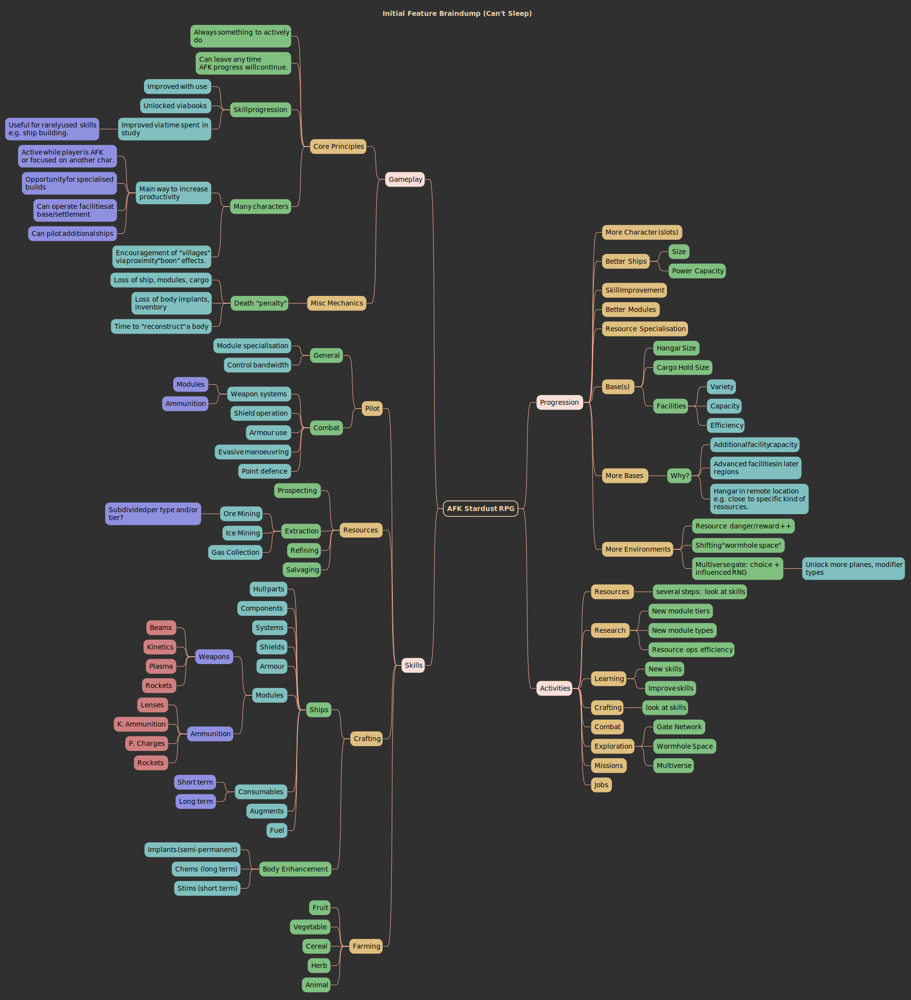
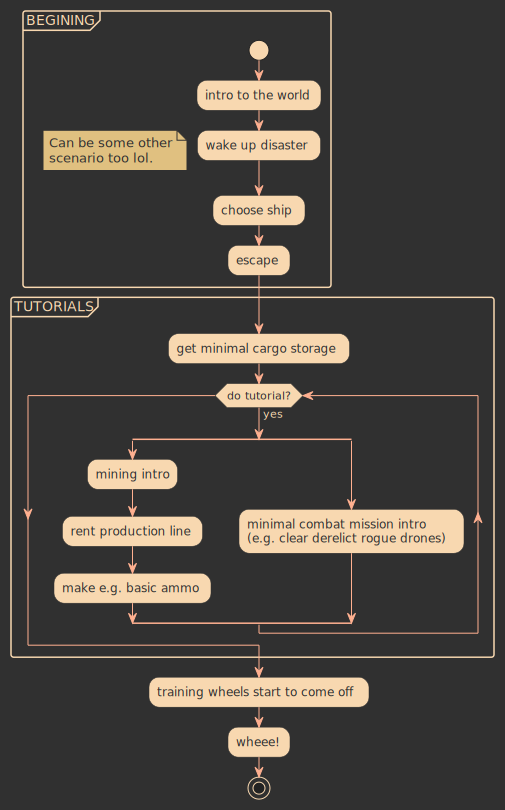

= PlantUML Theme "Moccafruit"

Primarily dark, generally warm and somewhat chocolatey tones with a little dash
of colour on the side.

== Mindmap

.example mindmap diagram

== Activity Diagram

.example activity diagram

